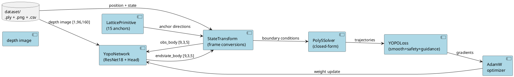

# Codebase Documentation

> Generated snapshot — may drift from codebase. Update directly when code changes; check for stale content regularly.

## Overview

YOPO is a learning-based, one-stage motion planner for aggressive quadrotor autonomous navigation in obstacle-dense environments. It collapses the classical perception→front-end search→back-end optimization pipeline into a single neural network forward pass. The network takes a depth image and vehicle state, predicts 15 candidate trajectory end-states (offsets from fixed angular anchors), scores them via a self-supervised cost function, and selects the cheapest primitive for execution.

**Key concept**: Like YOLO for object detection, the planner predicts trajectory offsets and scores from a grid of motion primitive anchors in one shot — no iterative optimization, no online simulation.

**Paper**: [You Only Plan Once: A Learning-Based One-Stage Planner With Guidance Learning](https://ieeexplore.ieee.org/document/10528860) (IEEE)  
**V2**: [YOPOv2-Tracker: An End-to-End Agile Tracking and Navigation Framework](https://arxiv.org/html/2505.06923v1)  
**License**: MIT (TJU-Aerial-Robotics, 2024)

---

## Repository Structure

```
YOPO/
├── YOPO/                  # Neural planner: training + inference (Python/PyTorch)
│   ├── config/            #   Config loader + traj_opt.yaml (all hyperparameters)
│   ├── policy/            #   Network, dataset, trainer, primitive lattice, solver
│   │   └── models/        #   ResNet18 backbone + YopoHead
│   ├── loss/              #   Loss functions: smoothness, safety, guidance, score
│   ├── schema.py          #   Pydantic config schema (YOPOConfig)
│   ├── cli.py             #   CLI entry point: yopo train|trt|visualize|validate
│   └── saved/             #   Pre-trained weights (YOPO_1/epoch50.pth)
│
├── Controller/            # Quadrotor dynamics + SO(3) attitude controller (C++/ROS)
│   └── src/
│       ├── so3_control/       # SO(3) geometric controller + network control node
│       ├── so3_quadrotor_simulator/ # Physics simulation (ODE integration)
│       └── utils/
│           ├── quadrotor_msgs/     # Custom ROS messages (PositionCommand, SO3Command, etc.)
│           ├── mavros_msgs/        # Vendored MAVROS message subset
│           └── uav_utils/          # Shared UAV utility headers
│
├── Simulator/             # Sensor simulator: ray-cast depth + LiDAR (C++/CUDA/ROS)
│   └── src/
│       ├── src/               # CPU/GPU ray casters, map generation, Perlin noise
│       ├── include/           # Headers + CUDA kernels
│       └── config/            # Simulator config (camera, LiDAR, environment params)
│
├── docker/data-gen/       # Standalone CUDA dataset generator (Docker, no ROS)
│   ├── Dockerfile             # Multi-stage: nvidia/cuda:12.4.1
│   ├── src/dataset_generator.cpp # Batch ray-casting → PNG + CSV
│   ├── config/config.yaml     # Generation parameters
│   └── entrypoint.sh          # Runtime entrypoint
│
├── dataset/               # Mount point for generated training data
│   └── data/                  # {0-9}/img_N.png + pose-N.csv + pointcloud-N.ply
│
├── docs/                  # Media assets (GIFs, PNGs) for README — no text docs
├── PrimitivesAnalysis.md  # Deep technical analysis (541 lines)
├── AGENTS.md              # Durable agent rules (workspace layout, conventions, safety)
├── Makefile               # Docker-based data generation orchestration
├── pyproject.toml         # Python project metadata + deps (uv/pip)
├── README.md              # Project overview + install/test/train instructions
└── LICENSE                # MIT
```

**Architecture pattern**: Hybrid monorepo with 3 independent build systems — 2 ROS catkin workspaces (Controller, Simulator) + 1 Python project (YOPO) + 1 Docker container (data-gen). Components communicate via ROS topics at runtime.

---

## Architecture

### System Data Flow



**Source anchors:**
- `YOPO/policy/yopo_network.py` — `YopoNetwork.forward()`: depth → ResNet18 feature, concat obs, Conv1x1 → tanh + softplus
- `YOPO/policy/primitive.py` — `LatticePrimitive` generates 5×3 polar grid of motion primitive anchors
- `YOPO/policy/state_transform.py` — `StateTransform._pred_to_endstate()`: delta offsets → body-frame end states
- `YOPO/loss/loss_function.py` — `YOPOLoss.forward()`: smoothness, safety, guidance cost computation
- `YOPO/policy/yopo_trainer.py` — `YopoTrainer`: AdamW optimizer, DataLoader, TensorBoard/WandB logging

### Three-Frame Coordinate System

| Frame | Axes | Usage |
|-------|------|-------|
| **World (W)** | NWU: X=North, Y=West, Z=Up | Absolute position, ESDF queries |
| **Body (B)** | X=forward, Y=left, Z=up | Odometry input, control output |
| **Primitive (P_i)** | Z toward anchor direction | Network predicts offsets here |

Transform chain: `obs_world → obs_body (R_wb⁻¹) → obs_primitive (R_bp, per-anchor) → network forward → pred_primitive → pred_body (R_bp) → pred_world (R_wb)`

### Neural Network Architecture

```
Inputs:
  depth [B, 1, 96, 160]  →  Modified ResNet18  →  feature [B, 64, 3, 5]
  obs   [B, 9, 3, 5]     →  (identity)          →  feature [B, 9, 3, 5]
                                        │
                              Concat → [B, 73, 3, 5]
                                        │
                              YopoHead: 3× Conv2d(1×1, 256→256→10)
                                        │
                              Split:
                                endstate [B, 9, 3, 5]  (tanh → positions, velocities, accelerations)
                                score    [B, 1, 3, 5]  (softplus → positive cost estimate)
```

The 3×5 output grid maps one-to-one to the 15-primitive lattice (3 vertical × 5 horizontal anchors).

### Motion Primitive Lattice

- **15 primitives**: 5 horizontal × 3 vertical × 1 radial layer
- **Anchor yaw**: -36°, -18°, 0°, +18°, +36° (18° step)
- **Anchor pitch**: -20°, 0°, +20° (20° step)
- **Radius**: 5.0 m
- **Network offsets**: delta_yaw ±15°, delta_pitch ±15°, radio [0, 10] m
- **Adjacent primitives overlap by 12° (yaw) / 10° (pitch)** — no coverage gaps

### Training Strategy: Guidance Learning

Unlike imitation learning (requires expert demos) or RL (requires online interaction), YOPO **backpropagates trajectory cost gradients directly through the network**:

1. Network predicts 15 end-states from depth + state
2. Closed-form polynomial solver computes trajectories
3. Analytical costs (smoothness + safety + guidance) are computed — fully differentiable
4. Gradients flow from cost → polynomial → network weights
5. Score head learns to predict trajectory cost via self-supervised Smooth L1

---

## Data Layer

### Data Generation Pipeline

The dataset is fully offline and procedurally generated:

```
[Config YAML] → Docker Build (CUDA + PCL + OpenCV)
                        │
                        ▼
              dataset_generator.cpp
                        │
           ┌────────────┼────────────┐
           ▼            ▼            ▼
     maps.cpp      sensor_simulator.cu    dataset_generator.cpp
     (procedural   (CUDA raycast to      (sampling + save)
      point cloud)  depth image)
           │            │                  │
           ▼            ▼                  ▼
     pointcloud-N.ply  img_N.png      pose-N.csv
```

### Map Types (`maze_type`)

| Type | Name | Description |
|------|------|-------------|
| 1 | Cave | 3D Perlin noise |
| 2 | Pillars | Random rectangular pillars |
| 3 | Maze | Recursive division 2D maze |
| 5 | Forest | Poisson-disc tree placement |
| 6 | Rooms | Grid of rooms with windows |
| 7 | Walls | Random oriented walls |

### Dataset Format

```
dataset/data/
  pointcloud-0.ply ... pointcloud-9.ply   # Environment point clouds
  pose-0.csv ... pose-9.csv               # 10,000 pose labels each
  0/img_0.png ... 9/img_9999.png          # 16-bit depth images (160×90)
```

- **Depth images**: 16-bit PNG, normalized [0, 65535] → [0, 1], max depth 20 m
- **Pose CSV**: `px,py,pz,qw,qx,qy,qz` (world-frame camera pose)
- **Training split**: 90/10 per environment via sklearn
- **Training-time augmentation**: Velocities, accelerations, and goals are synthetically sampled (not from dataset), allowing each static depth image to be reused with many different motion states.

---

## Core Logic

### Key Design Decisions

1. **Closed-form polynomials, no iterative optimization at inference** — the `Coef_inv` matrix gives polynomial coefficients in O(1). All trajectory evaluation is analytic.

2. **Fixed angular lattice, learnable deltas** — anchor directions are hardcoded; the network only predicts offsets. This constrains the output space and guarantees geometrically sensible end-states.

3. **Body-frame inputs, primitive-frame computation** — raw observations are rotated into each primitive's local frame before the network sees them. The network predicts offsets relative to known anchor directions.

4. **Self-supervised score learning** — the network learns to predict which of its own trajectories will have the lowest cost. A form of implicit Q-learning without an explicit value function.

5. **Differentiable cost at training, min-score selection at test** — gradients flow from trajectory quality back through the network. At test time, only the cheapest primitive is executed.

6. **Speed-normalized loss weights** — smoothness scales as speed⁵, acceleration as speed³, safety as 1/speed.

### Loss Functions

| Component | Weight | Formula |
|-----------|--------|---------|
| Smoothness (jerk²) | ws=10.0 | dᵀ·R_J·d (quadratic form) |
| Acceleration² | wa=1.0 | dᵀ·R_A·d (quadratic form) |
| Safety | wc=1.0 | Σ exp(-(d_i - d₀)/r), d₀=1.2m, r=0.6m |
| Guidance | wg=0.15 | L1(goal_length, traj_along) + 0.5·∥traj_perp∥₂ |
| Score | 1.0 | Smooth L1(pred_score, detach(traj_cost)) |

### Runtime Selection

At inference, the 15 primitives are ranked by predicted score; the lowest-score (cheapest) primitive is selected and its polynomial trajectory is executed at 50 Hz. Re-planning occurs when the segment time (~1.67 s) expires and a new depth image arrives.

---

## Reference

### Domain Glossary

| Term | Definition |
|------|------------|
| **YOPO** | You Only Plan Once — one-stage motion planner (analogous to YOLO) |
| **Motion Primitive** | A candidate trajectory defined by anchor direction + network-predicted offsets |
| **Primitive Anchor** | Fixed angular direction in the 15-element spherical lattice (5 horizontal × 3 vertical) |
| **Anchor Lattice** | Deterministic angular grid: yaw ∈ {-36°, -18°, 0°, +18°, +36°}, pitch ∈ {-20°, 0°, +20°} |
| **delta_yaw / delta_pitch** | Network-predicted angular offsets from anchor directions (±15° max) |
| **radio** | Network-predicted end-position distance along anchor ray [0, 10] m |
| **Poly5Solver** | Closed-form 5th-order polynomial solver mapping boundary conditions → coefficients |
| **endstate** | 9-dim vector: (pos_x, pos_y, pos_z, vel_x, vel_y, vel_z, acc_x, acc_y, acc_z) at trajectory endpoint |
| **ESDF / SDF** | (Euclidean) Signed Distance Field — voxel grid storing distance to nearest obstacle |
| **Guidance Learning** | Training via direct backpropagation of trajectory cost gradients (no expert demos, no RL) |
| **Score Loss** | Self-supervised: network learns to predict its own trajectory cost |
| **d₀ (d0)** | Safe clearance distance = 1.2 m |
| **r** | Safety cost exponential decay rate = 0.6 m |
| **vel_max_train / acc_max_train** | Training velocity/acceleration bounds (6.0 m/s, 6.0 m/s²) |
| **Control dt** | 50 Hz control loop = 0.02 s |
| **Segment Time** | ~1.67 s per trajectory (2 × radio_range / vel_max_train) |
| **Body Frame (B)** | Drone-centric: X=forward, Y=left, Z=up |
| **World Frame (W)** | NWU: X=North, Y=West, Z=Up |
| **Primitive Frame (P_i)** | Per-anchor frame with Z pointing toward anchor direction |
| **SO(3)** | 3D rotation group; SO3Control = geometric attitude controller |
| **HGDO** | High-Gain Disturbance Observer — compensates external forces (wind, etc.) |
| **plan_from_reference** | Controller mode: use previous step's desired state vs. instantaneous odometry |
| **env** | Depth format selector: `simulation` (meters, 32FC1) vs `435` (mm, 16UC1 for RealSense D435) |

---

## Documentation Index

| Document | Path | Description |
|----------|------|-------------|
| Project README | `README.md` | Overview, install, test, train, TensorRT/RKNN deployment |
| Agent Rules | `AGENTS.md` | Durable rules: workspace layout, conventions, safety constraints |
| Technical Deep-Dive | `PrimitivesAnalysis.md` | 541-line analysis of primitives, ray casting, coordinate frames, data flow |
| Simulator README | `Simulator/src/readme.md` | Build instructions, config walkthrough, performance benchmarks |
| Controller README | `Controller/src/readme.md` | Build, control modes, pub/sub reference |
| Config Reference | `YOPO/config/traj_opt.yaml` | All hyperparameters with inline comments |
| Simulator Config | `Simulator/src/config/config.yaml` | Sensor and environment parameters |
| Python Project | `pyproject.toml` | Dependencies, entry points, lint/format rules, pytest config |
| Makefile | `Makefile` | Docker image/data generation targets |
| License | `LICENSE` | MIT |

### Known Documentation Gaps

- No Architecture Decision Records (ADRs)
- No CONTRIBUTING.md or code of conduct
- No generated API reference
- No automated test suite or CI configuration
- No hardware documentation in this checkout (available via GitHub Releases)
- No tutorials or Jupyter notebooks
